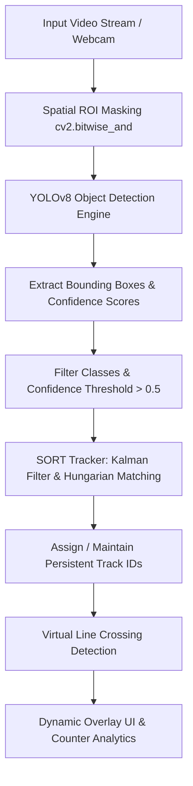

# 🎯 Real-Time Object Detection, Tracking & Automated Analytics (YOLOv8 + SORT)

[](https://www.python.org/)
[](https://docs.ultralytics.com/)
[](https://opencv.org/)
[](LICENSE)

An end-to-end Computer Vision and Deep Learning system engineered for high-speed object detection, persistent multi-object tracking (MOT), and automated spatial analytics. Powered by **YOLOv8** and **SORT (Simple Online and Realtime Tracking)**, this repository delivers production-grade pipelines for intelligent traffic analysis, crowd footfall monitoring, and real-time surveillance.

---

## 💡 Key Highlights & recruiter Summary

This project showcases production-level deep learning integration and real-time computer vision engineering:
* **Production Deep Learning:** Seamlessly integrates PyTorch-backed YOLOv8 state-of-the-art architectures for accurate multi-class detection across 80+ COCO classes.
* **Advanced Multi-Object Tracking (MOT):** Solves object ID switching and visual occlusion using the SORT algorithm (Kalman Filter trajectory prediction + Hungarian Algorithm data association).
* **Spatial Optimization via ROI Masking:** Implemented OpenCV binary masking (`cv2.bitwise_and`) to eliminate background noise, reducing compute overhead and boosting frame rates (FPS).
* **Practical Edge Use Cases:** Built modular, field-ready applications for vehicle counting, pedestrian footfall monitoring, and live safety surveillance.

---

## ⚙️ Tech Stack & Architecture

| Layer | Technologies / Tools |
| :--- | :--- |
| **Deep Learning Engine** | YOLOv8 (`yolov8n.pt`, `yolov8l.pt`), PyTorch, Ultralytics Framework |
| **Computer Vision** | OpenCV (CV2), CVZone |
| **Object Tracking (MOT)** | SORT (Kalman Filtering, Hungarian Algorithm, Bounding Box IoU) |
| **Core Language & Math** | Python 3.8+, NumPy, SciPy, Math |

### System Dataflow Architecture



---

## 📁 Repository Structure

```text
Object-detection-Yolo/
├── project-1 Car Counter/         # Automated Highway Traffic Monitoring System
│   ├── cars.py                    # Vehicle detection, tracking & line-crossing counter
│   ├── mask.png                   # Binary ROI mask for highway lanes
│   ├── graphics.png               # Graphical UI overlay header
│   └── sort.py                    # SORT multi-object tracking implementation
├── people-counter project-2/      # Pedestrian Footfall & Crowd Tracking Engine
│   ├── cars.py                    # Pedestrian tracking and dynamic counter script
│   ├── mask.png                   # Walkway binary ROI spatial mask
│   ├── img.png                    # Custom UI analytics overlay
│   └── sort.py                    # SORT tracking algorithm module
├── chapter 9-Yolo with webcam/   # Live Stream & Surveillance Camera Pipeline
│   └── yoloWebCam.py              # Real-time webcam processing & display script
├── Chapter 5-Running Yolo/        # Core verification scripts and model loading
├── videos/                        # Input benchmark videos and test samples
└── Yolo-weights/                  # Pre-trained YOLOv8 weights (yolov8n.pt, yolov8l.pt)
```

---

## 📊 Core Modules & Applications

### 1. 🚗 Automated Vehicle Traffic Counter
Monitors multi-lane vehicular traffic on highways or urban roads. Uses spatial binary masks to isolate road lanes, running YOLOv8 object detection exclusively on active vehicles. Calculates centroid trajectories and increments counter metrics upon crossing defined virtual boundaries.

### 2. 🚶 Pedestrian & Crowd Footfall Monitor
Tracks pedestrians in commercial spaces, walkways, and entrance checkpoints. Maintains persistent tracking IDs across temporary occlusions to calculate precise bidirectional footfall analytics.

### 3. 📹 Real-Time Live Webcam Surveillance Engine
Low-latency surveillance stream processor capable of real-time monitoring via webcam or RTSP live streams for safety inspection and automated alert triggers.

---

## 🛠️ Installation & Setup Guide

### Prerequisites
* Python 3.8+
* NVIDIA GPU + CUDA drivers (Recommended for hardware-accelerated real-time FPS)

### Quick Start

1. **Clone Repository:**
   ```bash
   git clone https://github.com/Pavankumar-code10/ObjectDetectionModel.git
   cd ObjectDetectionModel
   ```

2. **Set Up Virtual Environment:**
   ```bash
   # On Windows
   python -m venv .venv
   .venv\Scripts\activate

   # On Linux / macOS
   python3 -m venv .venv
   source .venv/bin/activate
   ```

3. **Install Core Dependencies:**
   ```bash
   pip install ultralytics opencv-python cvzone filterpy scikit-image lap numpy
   ```

---

## 🚀 Execution Instructions

### Run Vehicle Counter Module:
```bash
cd "project-1 Car Counter"
python cars.py
```

### Run People Counter Module:
```bash
cd "people-counter project-2"
python cars.py
```

### Run Live Webcam Stream Engine:
```bash
cd "chapter 9-Yolo with webcam"
python yoloWebCam.py
```

---

## 👨‍💻 Author

**Pavan Kumar**
* GitHub: [@Pavankumar-code10](https://github.com/Pavankumar-code10)
* Repository: [ObjectDetectionModel](https://github.com/Pavankumar-code10/ObjectDetectionModel)

---
*If you find this project valuable, please star ⭐ the repository to support the work!*
